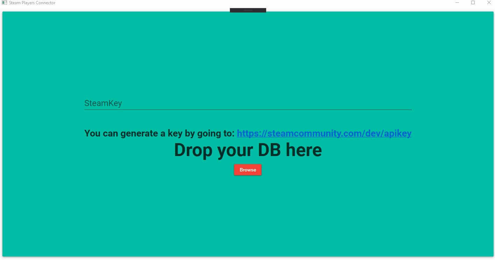

# Steam Players Connector

### Description:
Steam players connector is a simple program designed to help admins of CSGO servers to better identify abusive players by "connecting" their accounts together based mainly on their names and IP addresses. I originally created the program for personal use on my own CSGO server when I had many players re-joining the server with new accounts after their old accounts gets banned by Valve for cheating or when someone is using a "smurf" account on the server which usually indicates that this person is cheating and don't want to risk getting their main account banned.

### Frameworks used:

The program is a MVVM WPF application that uses [Prism](https://github.com/PrismLibrary/Prism) along side [Material Design In XAML Toolkit](https://github.com/MaterialDesignInXAML/MaterialDesignInXamlToolkit) for the visuals so huge thanks for the creators of both projects.
Also, I would never had thought of making the program in the first place if I didn't stumble upon the Rankme database so a big thanks for @rogeraabbccdd

### Background:

I made the program in 2019 in the span of 6 days but never made it with an intention to publish it, but since valve decided to make CSGO free to play I thought it could be useful for others to use. Also, since I wanted to have some work published as an indication of what I am capable of I decided to go back and make a few edits and add a little bit of documentation in order to publish it.

### Getting started:
If you are planning to use this program you need to:
- Generate a steam web-API key by going [here](https://steamcommunity.com/dev/apikey)

- Make sure that you already have ["RankMe Kento Edition"](https://forums.alliedmods.net/showthread.php?p=2467665) plugin installed, then you need to grab the database file which is located at:
    > csgo/addons/sourcemod/data/sqlite/rankeme.sq3

After entering the API key you can either use the file browser to locate the database file or just drag and drop.

### Features:
  - Material Design UI
  - Search after specific property automatically by double clicking the cell (e.g. IP)
  - Banned players are marked with a red row
  - Ability to only show banned players
  - Both names from the database and current names from steam are shown in case the player changes their name.
  - Multiple columns sorting. (hold shift)

### Demo:

    
### Todos

 - Add a feature to be able to auto grab the database from the server without user interaction
 - Add a feature to pick the theme

### Feedback:
If you have any question, suggestions, or find any bugs please feel free to open an issue or a pull request and I will try to respond as fast as possible.

